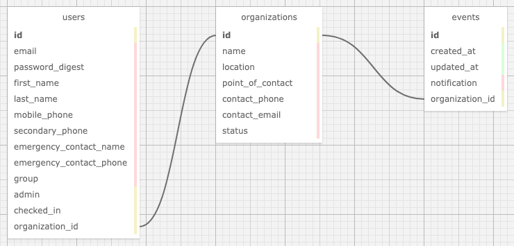

# Rally Point API
## _Back-end to [Rally Point](https://github.com/MicahOlson/rally-point)_
### by: Micah L. Olson
### created: 5/7/2021
### updated: 5/21/2021

---

## Description
This **CORS-enabled** back-end `Ruby on Rails` API provides an interface for its front-end `React` [counterpart](https://github.com/MicahOlson/rally-point) to access a database storing organization, event notification, and member information, as well as authentication and full **CRUD** functionality.

---

## Technologies
* Ruby
* Rails
* Bundler
* Rake
* PostgreSQL
* Puma
* Rack::Cors
* Markdown
* git

---

## Requirements
* You will need to use your system's **`terminal` emulator** to set up and locally use this API.

* **`PostgreSQL 12.6`** is required to serve this application's database.  
  ([how to install PostgreSQL 12.6](https://www.learnhowtoprogram.com/ruby-and-rails/getting-started-with-ruby/installing-postgres))

* You must have **`Ruby 2.6.5`** installed to be able to run this application.  
  ([how to install Ruby 2.6.5](https://www.learnhowtoprogram.com/ruby-and-rails/getting-started-with-ruby/installing-ruby))

* **`Bundler`** is needed to install all application dependencies. Install it *after* you install `Ruby`.
  ```bash
  $ gem install bundler
  ```

---

## Installation and Setup
* **Clone this repository** to a local directory using the command-line tools `cd` and `git`.  
  ([how to install git](https://www.learnhowtoprogram.com/introduction-to-programming/getting-started-with-intro-to-programming/git-and-github))
  ```bash
  $ cd ~/<local_directory>/
  $ git clone https://github.com/MicahOlson/rally-point-api.git
  ```

* **Navigate to the top level directory** of the cloned repository.  
  ```bash
  $ cd rally-point-api/
  ``` 

* **Install all application dependencies** using `Bundler`.
  ```bash
  $ bundle install
  ```

* **Start the `PostgreSQL` database system** and keep it running while you interact with this service.
  ```bash
  $ postgres
  ```

  * Access the command line again by opening another `terminal` tab. Press and briefly hold these key combinations.  
    `command-t` (macOS) or `control-t` (Windows, GNU/Linux)

  * IMPORTANT! Be sure to **shut the database system down** when you are done using the app.  
    `control-c`

* **Recreate the databases** and **seed** a sample dataset.
  ```bash
  $ bundle exec rake db:setup
  ```

* The following **database schema** is automatically created by the above command.
  <div>
    
  </div>

* **Launch the local `Puma` web server** to start the API service.
  ```bash
  $ rails server
  ```

  * IMPORTANT! Be sure to **shut the web server down** when you are done using the app.  
    `control-c`

* Type **localhost:3000** into your browser's address bar and hit `enter`.

* **Set up the front-end application** for this project at https://github.com/MicahOlson/rally-point.

---

## Code Editors
* **Recommendations** if you would like to utilize a **GUI** for opening or editing this application's files:
  * [Visual Studio Code](https://code.visualstudio.com) - "Code editing. Redefined."
  * [Atom](https://atom.io) - "A hackable text editor for the 21st Century."
  * [SublimeText](https://www.sublimetext.com) - "A sophisticated text editor for code, markup and prose."

---

## Notes, Bugs, Fixes, and Future Improvements
* No known bugs.
* E2E testing to be incorporated at a future point in time.
* If you find a bug, please report it at the email address below.

---

## License
[MIT](https://choosealicense.com/licenses/mit/)  
Copyright &copy; 2021 Micah L. Olson  

---

## Contact
Micah via [email](mailto:micah.olson@protonmail.com) | [LinkedIn](https://www.linkedin.com/in/micah-lewis-olson/) | [GitHub](https://github.com/MicahOlson)
